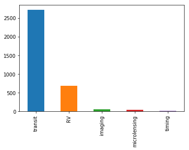
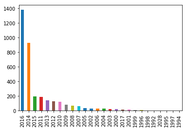

# Exo_Planet_Data_Analysis

The accuracy score that produced the best result is Random Forest Classifier with an accuracy score of 95.4%. This model will tell us iof a new planet can host life with a 95.4% accuracy.

Most of the planets were dicovered using the Transit Method.  The second most utilized method was RV Method.

Most of the planets were dicovered by Kepler Telescope which was launched into space in 2013.  Most of the planets were discovered between 2015 and 2017.

